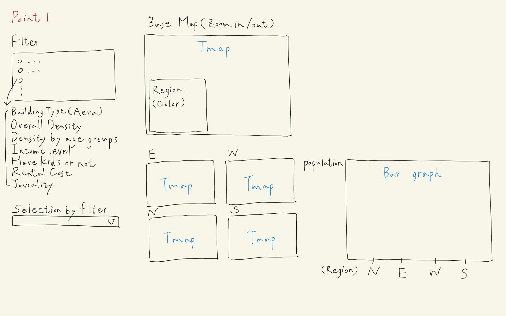
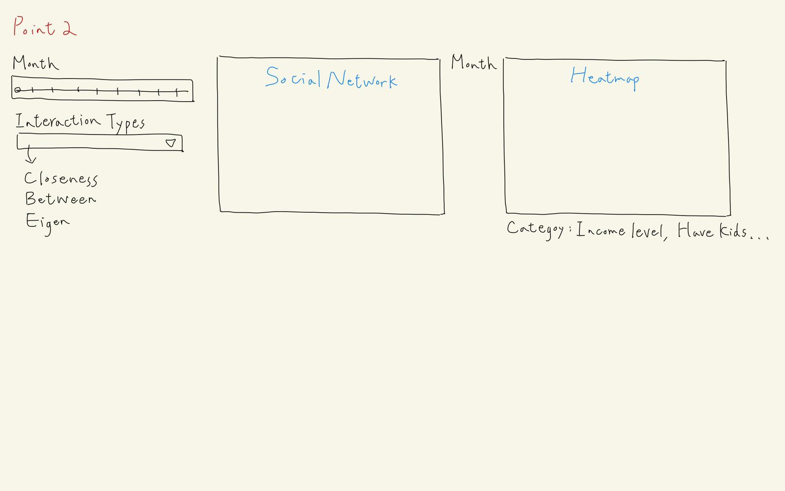
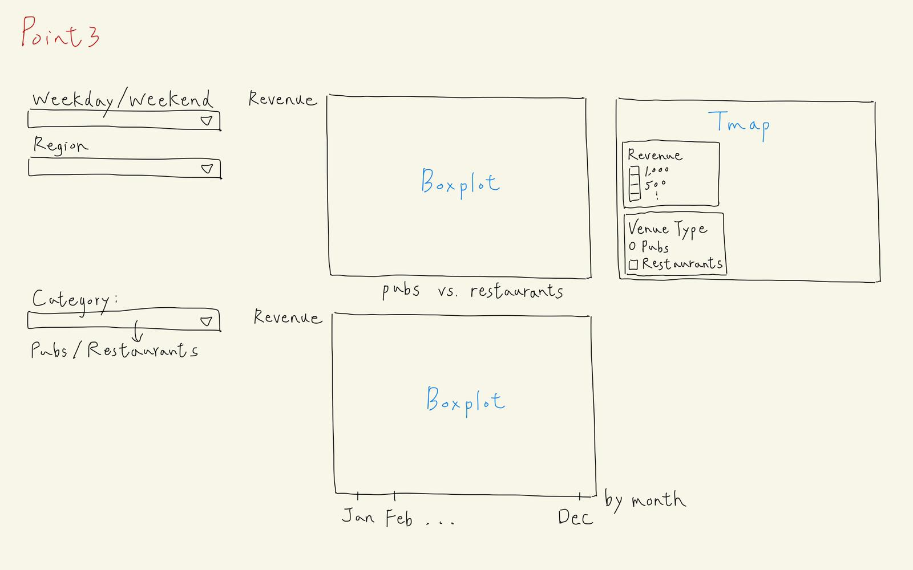

```{r setup, include=FALSE}
knitr::opts_chunk$set(echo = FALSE)
```

## Background

Anticipating rapid growth, the city of Engagement, Ohio USA is doing a participatory urban planning exercise to understand the current state of the city and identify opportunities for future growth. About 1000 representative residents in this modest-sized city have agreed to provide data using the city’s urban planning app, which records the places they visit, their spending, and their purchases, among other things. From these volunteers, the city will have data to assist with their major community revitalization efforts, including how to allocate a very large city renewal grant they have recently received. 

## Challenge Selection

Our group have decided to tackle **Challenge 1: Demographics and Relationships**. This challenge involves understanding the city’s demographics. Given social networks and other information about the city, our team will analyze the available data to prepare a one-page fact sheet about the city’s demographics, its neighborhoods, and its business base.

Our team will use visual analytic techniques to address the following questions:

  - Assuming the volunteers are representative of the city’s population, characterize what you can about the demographics of the town.
  - Consider the social activities in the community. What patterns do you see in the social networks in the town?
  - Identify the predominant business base of the town, and describe patterns you observe.
  
## Motivation

The motivation of our group based on the different question is as such:

  - Our group will be providing insights on the diversity of the population by the different regions of the city. Residents will have a **better understanding on the spread of the population** and **provide new residents insights** on where is the best region based on their `needs` and `status`.
  - From the social activities and network, we will be **providing insights on who are the influential resident** on `weekdays` (work influence) and `weekends` (social influence). This will allow them to understand who they can approach if they require any assistance based on their needs.
  - We will be providing insights on the predominant business base of the town based on different time periods. Residents will have a better understanding on what businesses the city is focusing on and possible trends on the business revenue.


## Possible Obstacle

There is one obstacle our team might encounter and will share on how we intend to overcome the obstacle.

 - **Huge File Size**: Due to vast amount of interaction collected inside the social network journal, we are unable extract all the interaction and analyse it at one go. Our team decided to retrieve only the first week of all the months to analyse on the weekday and weekend interaction to ensure all months are covered for the analyse. This will significantly reduce the file size of the data set.


## Approach

These are the approaches by our team to tackle the different questions.

### Question 1 - Demographics of the Town

To understand the demographics of the town, our team will first split the city into different regions. Our team will then analyse the distribution of the following inputs:

   - *Building Type*: % of Commercial and Residential area in the Region
   - *Overall Density*: Population Density across the region
   - *Density by Age Group*: Age Group Density across the region
   - *Income Level*: Income Level distribution across the region
   - *Kids*: Distribution of resident with/without kids across the region
   - *Rental Cost*: Rental Cost of apartments across the region
   - *Joviality*: Distribution of Participants based on their joviality across the region
   
A total of **3** (2 static and 1 interactive) graphs will be plotted. Statistical graph (bottom right) will be plotted to provide statistical evidence on the distribution of Participant's attribute across the region. 



### Question 2 - Social Network Patterns

To understand the social network patterns, our team will identify the interaction count based on attributes throughout the year using a `heatmap`. Lastly, identifying residents that are influential (`eigenvector`), middleman between industries (`betweenness`) and information spreader (`closeness`). 




.png)


### Question 3 - Predominant Business Base

To understand the predominant business base of the town, we will first find out the amount spend by residents in various pubs/restaurants. 

Revenue of restaurants = Visit * Cost of Meal
Revenue of Pubs = Total time spent in Pub * Hourly cost in Pub

We will analyse the amount spent in pubs and restaurants across the different regions, using an interactive `tmap` to look at the individual pubs/restaurants. Lastly, a statistical plot to identify the different amount spent across the year by the different venue type.



## Data Set

To analyse and plot the required graphs, these are the data set and their description that our team will be exploring:

  - **Participant.csv**: To retrieve all participant's information
  - **Socialnetwork.csv**: To retrieve all interaction of participants
  - **Pubs.csv**: To retrive pubs information such as BuildingId and HourlyCost
  - **Restaurants.csv**: To retrieve restaurants information such as BuildingId and FoodCost
  - **Buildings.csv**: To retrieve the building polygons
  - **Apartments.csv**: To retrieve location and rental cost of Apartments
  - **CheckInJournal.csv**: To retrieve the number of check-ins for Pubs, Restaurants and Home
  - **FinancialJournal.csv**: To retrieve the wage of participants


